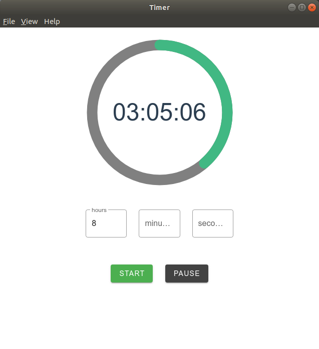

# vue-electron-timer

A simple count down timer app 

## Build Setup

``` bash
# install dependencies
yarn

# run in development mode
yarn dev

# build app under your OS (Linux, macOS, Windows)
yarn build
```


